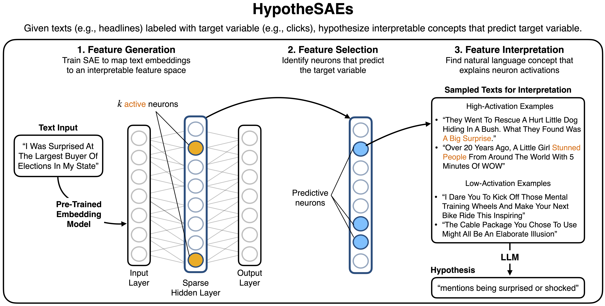
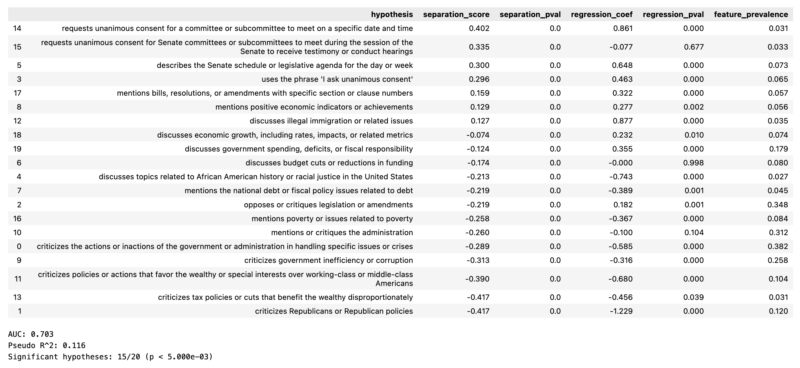

# HypotheSAEs: Sparse Autoencoders for Hypothesis Generation

HypotheSAEs is a method which produces interpretable relationships ("hypotheses") in text datasets explaining how input texts are related to a target variable. 
For example, we can use HypotheSAEs to hypothesize concepts that explain which news headlines receive engagement, or whether a congressional speech was given by a Republican or Democrat speaker. 
The method works by training Sparse Autoencoders (SAEs) on expressive representations of input texts, and then interpreting predictive neurons learned by the SAE.

Preprint 📄: [Sparse Autoencoders for Hypothesis Generation](https://arxiv.org/abs/2502.04382). [Rajiv Movva](https://rajivmovva.com/)\*, [Kenny Peng](https://kennypeng.me/)\*, [Nikhil Garg](https://gargnikhil.com/), [Jon Kleinberg](https://www.cs.cornell.edu/home/kleinber/), and [Emma Pierson](https://people.eecs.berkeley.edu/~emmapierson/).  
Website 🌐: https://hypothesaes.org  
Data 🤗: https://huggingface.co/datasets/rmovva/HypotheSAEs (to reproduce the experiments in the paper)

Please either open an issue, or contact us at rmovva@berkeley.edu and kennypeng@cs.cornell.edu, if you have any questions or suggestions.

## FAQ

1. **What do I need to run HypotheSAEs?**  
You need a dataset of texts (e.g., news headlines), a target variable (e.g., clicks) which is at least partially predictable from text*, and an OpenAI API key. Running the method will then output a list of natural language hypotheses: to be precise, these hypotheses are concepts which, when they appear in the text, are hypothesized to affect the target variable. (The hypothesis's coefficient determines the direction of the effect.)  

2. **How do I get started?**  
See the [Quickstart](#quickstart) section. The easiest way to get started is to clone and install the repo, and then adapt the [quickstart notebook](https://github.com/rmovva/hypothesaes/blob/main/notebooks/quickstart.ipynb) to your dataset.

3. **Which LLMs does HypotheSAEs support?**  
Currently, **running HypotheSAEs requires using the OpenAI API**, at minimum to query LLMs for feature interpretation, but also optionally to compute text embeddings and evaluate hypothesis generalization. By default, we use GPT-4o for interpretation and GPT-4o-mini for concept annotation; these can be changed.
We are in the process of expanding compatibility to other model providers (Anthropic, Google Gemini, etc.): please send us a note if this is critical to your workflow so that we can prioritize it. 
(Note that if data privacy is a concern, [upon request](https://help.openai.com/en/articles/8660679-how-can-i-get-a-business-associate-agreement-baa-with-openai-for-the-api-services), OpenAI may agree to a custom data retention policy.)

4. **What tasks does HypotheSAEs support?**  
Currently, the repo only supports **binary classification** and **regression** tasks. For target variables which have multiple categorical classes, we recommend using a one-vs-rest approach to convert the problem to binary classification. We hope to implement a feature selection method which natively supports multiclass classification in the future.  
You can also use HypotheSAEs to study pairwise tasks (regression or classification), e.g., whether a news headline is more likely to be clicked on than another. See the experiment reproduction notebook for an example of this on the Headlines dataset.

5. **How much does HypotheSAEs cost?**  
See the [Cost](#cost) section for an example breakdown.

6. **What compute infrastructure does HypotheSAEs require?**  
Using a GPU will speed up SAE training for large datasets, but we found that even on a laptop, training an SAE doesn't take prohibitively long (i.e., minutes to hours). If it is too slow, subsampling your dataset may be helpful. Google Colab also offers free/low-cost GPU access.

*You don't need _great_ predictions, just some signal above random chance. For example, predicting social media post engagement from text alone would have modest (but probably statistically significant) performance. To evaluate whether you have signal, you can first try training a simple linear model to predict the target variable from text embeddings. If you don't see _any_ predictive signal, HypotheSAEs is unlikely to be useful, since the method relies only in the information present on the input text representations.

## Method

HypotheSAEs has three steps:
1. **Feature Generation**: Train a Sparse Autoencoder (SAE) on text embeddings. This maps the embeddings from a blackbox space into an interpretable feature space for your data distribution.
2. **Feature Selection**: Select the learned SAE features which are most predictive of your target variable (e.g., using correlation or an L1-regularized multivariate regression).
3. **Interpretation**: Generate a natural language interpretation of each feature using an LLM. Each interpretation serves as a hypothesis about what predicts the target variable.  

After generating hypotheses, you can test whether they generalize on a heldout set: using only the natural language descriptions of the hypotheses, can we predict the target variable?

<p align="center">
  
</p>

# Usage

## Setup

Clone the repo and install in editable mode. This will also install any missing dependencies.

```bash
git clone https://github.com/rmovva/hypothesaes.git
cd hypothesaes
pip install -e .
```

## Quickstart

**See `notebooks/quickstart.ipynb` for a complete working example** on a subset of the Yelp restaurant review dataset. The input is review text and the target variable is 1-5 star rating. For many use cases, adapting this notebook should be sufficient. 

We also walk through the steps of the quickstart notebook below.  

0. **Set your OpenAI API key** as an environment variable:
```bash
export OPENAI_KEY_SAE="your-api-key-here"
```
Alternatively, you can set the key in Python (*before* importing any SAE functions) with `os.environ["OPENAI_KEY_SAE"] = "your-api-key"`. 

1. **Generate text embeddings.** You can either (1) provide your own embeddings, (2) use the OpenAI API, or (3) use a SentenceTransformers model locally:

```python
from src.embedding import get_openai_embeddings, get_local_embeddings

texts = ["text1", "text2", ...]  # List of text examples

# (1) Use your own embeddings
embeddings = np.random.rand(len(texts), 1024)  # Replace with your actual embeddings

# (2) Use OpenAI API
text2embedding = get_openai_embeddings(texts, model="text-embedding-3-small", cache_name="my_dataset_openai-small")

# (3) Use a SentenceTransformers model to generate embeddings locally
text2embedding = get_local_embeddings(texts, model="nomic-ai/modernbert-embed-base", cache_name="my_dataset_modernbert-base")

embeddings = np.stack([text2embedding[text] for text in texts])
```

2. **Train an SAE** on the text embeddings. Note that $M$ and $K$ are key hyperparameters; read below for heuristics on choosing them.
```python
from src.quickstart import train_sae

sae = train_sae(embeddings=embeddings, M=256, K=8, checkpoint_dir="checkpoints/my_dataset_openai-small")
```

3. **Interpret random neurons** to explore the concepts learned by the SAE. This will output a random sample of neurons, their interpreted labels, and text examples which strongly activate them:
```python
from src.quickstart import interpret_sae

interpretations = interpret_sae(
    texts=texts,
    embeddings=embeddings,
    sae=sae,
    n_random_neurons=5
)
```

4. **Generate hypotheses** about which neurons are predictive of your target variable:
```python
from src.quickstart import generate_hypotheses

hypotheses = generate_hypotheses(
    texts=texts,
    labels=labels,
    embeddings=embeddings,
    sae=sae,
    cache_name=cache_name,
    n_selected_neurons=20
)

display(hypotheses)
```

5. **Evaluate hypothesis generalization** on a heldout set:
```python
from src.quickstart import evaluate_hypotheses

metrics, evaluation_df = evaluate_hypotheses(
    hypotheses_df=hypotheses,
    texts=holdout_texts,
    labels=holdout_labels,
    cache_name=cache_name
)

display(evaluation_df)
print(metrics)
```

The output of step 5 is a table of hypotheses with metrics summarizing how well they predict the target variable:

<p align="center">
  
</p>

The dataframe contains the following columns:
- `hypothesis`: The natural language hypothesis (which came from interpreting a predictive neuron in the SAE)
- `separation_score`: How much the target variable differs when the concept is present vs. absent (i.e., $E[Y\mid\text{concept} = 1] - E[Y\mid\text{concept} = 0]$).
- `separation_pvalue`: The t-test p-value of the null hypothesis that the separation score is 0 (i.e., the concept is not associated with the target variable).
- `regression_coef`: The coefficient of the concept in a multivariate linear regression of the target variable on all concepts.
- `regression_pval`: The p-value of the null hypothesis that the regression coefficient is 0.
- `feature_prevalence`: The fraction of examples that contain the concept.

Additionally, we output the evaluation metrics used in the paper:
- AUC or $R^2$: how well the hypotheses collectively predict the target variable in the multivariate regression.
- Significant hypotheses: the number of hypotheses that are significant in the multivariate regression at a specified significance level (default $0.1$) after Bonferroni correction.

### Cost

Generating hypotheses using 20K Yelp reviews on the quickstart dataset takes ~2 minutes and costs ~$0.40:
- $0.05 for text embeddings (OpenAI text-embedding-3-small). This cost scales with dataset size.
- $0.15 to interpret neurons (GPT-4o). This cost scales with the number of neurons you interpret (but not with dataset size).
- $0.19 to score interpretation fidelity (GPT-4o-mini). This step isn't strictly necessary, and its cost also only scales with the number of neurons you interpret.

Evaluating hypothesis generalization for 20 hypotheses on a heldout set of 2K reviews requires 40K annotations. With GPT-4o-mini, this costs $3.50 and takes ~10 minutes using 30 parallel workers (the default value, but this may need to be reduced depending on your token rate limits).

## Tips for better usage and results

### tl;dr

1. **SAE hyperparameters**: The key hyperparameters are `M` and `K`: these will substantially influence the **granularity** of the concepts learned by the SAE. **See below** for reasonable choices based on dataset size.

2. **Caching**: The library saves and loads from caches to avoid redundant computation: we check for existing text embeddings, SAE model checkpoints, and LLM annotations at locations specified by `cache_name` (for embeddings and annotations) and `checkpoint_dir` (for SAE models). We therefore recommend passing in `cache_name` to `get_openai_embeddings()` and `generate_hypotheses()` and `checkpoint_dir` to `train_sae()`. **See below** for further explanation.

3. **Feature selection method**: By default, we select neurons using **correlation with the target variable**, since it is fast and easy to understand. You can also try selecting neurons using **separation score** or **LASSO**. We use LASSO in the paper; **see below** for pros and cons.

Less important:

4. **Sampling texts for interpretation**: By default, we interpret a neuron by prompting an LLM with the top-10 texts that activate the neuron most strongly (and 10 random texts that do not activate the neuron). This can produce overly specific labels. If you run into this issue, you can instead sample 10 texts from the top decile or quintile of positive activations instead of the absolute top-10. See `notebooks/experiment_reproduction.ipynb` to see how we do this (we use this binned sampling strategy to produce the results in the paper).

5. **Scoring interpretation fidelity**: Sometimes, the LLM interpretation of a neuron will not actually summarize the neuron's activation pattern. One strategy to mitigate this issue is to generate 3 candidate interpretations per neuron, score each one, and use the top-scoring one. You can do this by setting `n_candidate_interpretations=3` in `generate_hypotheses()`. Scoring works by using a separate annotator LLM (default `gpt-4o-mini`) to annotate several top-activating and zero-activating examples according to the interpretation, and then computing F1-score (you can also choose to select based on precision, recall, or correlation instead).

### 1. Choosing SAE parameters: M and K

The SAE parameters `M` and `K` control the granularity of concepts learned by the model:
- `M` is the total number of concepts that can be learned across the dataset
- `K` is the number of concepts used to represent each example

Increasing either parameter yields more granular features. For example, with small values like `(M=16, K=4)`, a neuron for Yelp reviews might learn to detect mentions of "price". With larger values like `(M=32, K=4)`, separate neurons might learn to distinguish between "high prices" vs "low prices".

Rules of thumb for choosing `(M, K)` based on dataset size:
- `(M=64, K=4)` for ~1,000 examples
- `(M=256, K=8)` for ~10,000 examples  
- `(M=1024, K=8)` for ~100,000 examples

Larger datasets often warrant larger values of `M`. In contrast, `K` should scale with the size / complexity of the individual texts. Values of 1-32 typically work well for `K`; larger values may only be necessary for very long documents (which you should consider splitting into chunks, anyway).

### 2 . Caching embeddings, model checkpoints, and LLM annotations for reuse

By default, the library uses caching to avoid redundant computation:

- **Embeddings**: Stored in `emb_cache/` (or in any directory you specify with `os.environ["EMB_CACHE_DIR"]`), as chunks of up to 50K embeddings each. When you call `get_openai_embeddings()` or `get_local_embeddings()` with a `cache_name`, embeddings are saved to disk and reused in future runs. Embeddings are loaded from the cache into a dictionary, `text2embedding`. Embeddings can quickly take up lots of space, **so we recommend pointing the cache to a directory with plenty of storage.**

- **SAE Models**: Saved in `checkpoints/{checkpoint_dir}/SAE_M={M}_K={K}.pt`. The `quickstart.train_sae()` function first checks if a model with the specified parameters exists and loads it instead of retraining. If you would like to overwrite the existing model, set `overwrite_checkpoint=True`.

- **Annotations**: Stored in `annotation_cache/{cache_name}_interp-scoring.json` (annotations for scoring interpretations) and `annotation_cache/{cache_name}_heldout.json` (annotations for heldout evaluation). When interpreting neurons or evaluating hypotheses, the LLM annotations of whether examples contain a concept are cached to avoid redundant API calls.

Note that if you re-generate neuron interpretations, you will likely get slightly different strings (because the interpreter LLM uses temperature 0.7), so these new interpretations will require new annotations. 
The annotation cache is therefore usually less important than the embedding cache and saving SAE checkpoints.

### 3. Selecting predictive neurons

Three methods for selecting predictive neurons, implemented in `src/select_neurons.py`:

**Correlation** (default)
- $\text{corr}(i) = \text{pearsonr}(a_i, y)$ between activations $a_i$ of neuron $i$ and target $y$
- Select top `n_select` neurons with largest absolute values
- Fast
- Selects for both effect size and prevalence

**Separation score**
- $\text{sep}(i) = E[y \mid a_i \in \text{top-100}(a_i)] - E[y \mid a_i = 0]$ where $\text{top-100}(a_i)$ are the 100 highest activation values
- Select top `n_select` neurons with largest absolute values
- Fast
- `n_top_activating` controls the number of examples which count as "high-activating", default 100
- Focuses on effect size over frequency

**LASSO**
- $\text{coefLasso}(i) = \beta_i$, where $$\beta = \underset{\beta}{\text{argmin}} \left(\left\|y - \sum_i \beta_i a_i\right\|_2^2 + \lambda\|\beta\|_1\right).$$
- We select $\lambda$ such that the number of neurons with nonzero coefficients is exactly `n_select`
- Avoids collinearity
- Slow, particularly for classification (BCE objective is more difficult to optimize than MSE)
- For large classification tasks, we empirically find that using an MSE objective (with `classification=False`) is faster and does not substantially change the results


## Detailed usage notes

### Other parameters to generate_hypotheses()

The `generate_hypotheses` function accepts the following parameters:

Required parameters:
- `texts`: List of text examples to analyze
- `labels`: Binary (0/1) or continuous labels for classification/regression
- `embeddings`: Pre-computed embeddings for the input texts
- `sae`: A trained SAE model or list of SAE models
- `cache_name`: String prefix for storing model checkpoints and caches

Optional parameters:
- `classification`: Whether this is a classification task (auto-detected if not specified)
- `selection_method`: How to select predictive neurons ("separation_score", "correlation", "lasso"; default: "separation_score")
- `n_selected_neurons`: Number of neurons to interpret (default: 20)
- `interpreter_model`: LLM for generating interpretations (default: "gpt-4o")
- `annotator_model`: LLM for scoring interpretations (default: "gpt-4o-mini")
- `n_examples_for_interpretation`: Number of examples to use for interpretation (default: 20)
- `max_words_per_example`: Maximum words per example when prompting the interpreter LLM (default: 256)
- `interpret_temperature`: Temperature for interpretation generation (default: 0.7)
- `max_interpretation_tokens`: Maximum tokens for interpretation (default: 50)
- `n_candidate_interpretations`: Number of candidate interpretations per neuron (default: 1)
- `n_scoring_examples`: Number of examples for scoring interpretations (default: 100)
- `scoring_metric`: Metric for ranking interpretations ("f1", "precision", "recall", "correlation")
- `n_workers_interpretation`: Number of parallel workers for interpretation API calls (default: 10; note that this might need to be reduced depending on your OpenAI Tier)
- `n_workers_annotation`: Number of parallel workers for annotation API calls (default: 30; note that this might need to be reduced depending on your OpenAI Tier)
- `task_specific_instructions`: Optional task-specific instructions to include in the interpretation prompt

### Using the individual modules directly

The quickstart functions should cover most use cases, but if you need more control, you can use the individual modules directly.
The notebook `notebooks/detailed_usage.ipynb` uses these code snippets to analyze a subset of the Yelp dataset, so working through that notebook may also be useful.  

If you would like to run the method on a pairwise dataset, see how we generate results for the Headlines dataset in `notebooks/experiment_reproduction.ipynb`.

#### Training SAE and getting activations (``sae.py``)

Train Sparse Autoencoders given train text embeddings, M, and K. You can also provide validation embeddings, which are used for early stopping (if validation reconstruction loss does not decrease for a specified number of epochs).
```python
from src.sae import SparseAutoencoder, load_model

# Convert to PyTorch tensors
X_train = torch.tensor(train_embeddings, dtype=torch.float32).to(device)
X_val = torch.tensor(val_embeddings, dtype=torch.float32).to(device)

# Define parameters for SAE
M, K = 256, 8  # Number of neurons, number of active neurons
save_dir = f'./checkpoints/my_dataset'
save_path = f'{save_dir}/SAE_M={M}_K={K}.pt'

# Load existing model or train a new one
if os.path.exists(save_path):
    model = load_model(save_path).to(device)
else:
    model = SparseAutoencoder(
        input_dim=X_train.shape[1],
        m_total_neurons=M,
        k_active_neurons=K,
    ).to(device)
    
    model.fit(
        X_train=X_train,
        X_val=X_val,
        n_epochs=100,
        save_dir=save_dir,
    )

# Get activations from the model
activations = model.get_activations(X_train)
```

Note that the sparse autoencoder constructor, and the `fit()` method, accept many optional parameters. See the code for more details.

#### Selecting Predictive SAE Neurons (``select_neurons.py``)

Select neurons that are predictive of your target variable:
```python
from src.select_neurons import select_neurons

# Select neurons using different methods
selected_neurons, scores = select_neurons(
    activations=activations,
    target=labels,
    n_select=20,
    method="correlation",  # Options: "lasso", "correlation", "separation_score"
    # Method-specific parameters:
    # For lasso:
    # classification=False,  # Whether this is a classification task, which affects the loss function (BCE vs. MSE)
    # alpha=None,  # LASSO regularization strength (None = auto-search)
    # max_iter=1000,  # Maximum iterations for solver
    
    # For separation_score:
    # n_top_activating=100,  # Number of top-activating examples to consider
    # n_zero_activating=None,  # Number of zero-activating examples (None = same as top)
)
```
You can also implement your own selection method: the function should take in neuron activations and target labels, and return a list of selected neuron indices.

#### Interpreting SAE Neurons (``interpret_neurons.py``)

Interpret what concepts the selected neurons represent:
```python
from src.interpret_neurons import NeuronInterpreter, InterpretConfig, SamplingConfig, LLMConfig

# Task-specific instructions help the LLM generate better interpretations
TASK_SPECIFIC_INSTRUCTIONS = """All of the texts are reviews of restaurants on Yelp.
Features should describe a specific aspect of the review. For example:
- "mentions long wait times to receive service"
- "praises how a dish was cooked, with phrases like 'perfect medium-rare'"""

# Initialize the interpreter
interpreter = NeuronInterpreter(
    interpreter_model="gpt-4o",  # Model for generating interpretations
    annotator_model="gpt-4o-mini",  # Model for scoring interpretations
    n_workers_interpretation=10,  # Parallel workers for interpretation
    n_workers_annotation=50,  # Parallel workers for annotation
    cache_name="my_dataset",  # Cache name for storing annotations
)

# Configure interpretation parameters
interpret_config = InterpretConfig(
    sampling=SamplingConfig(
        n_examples=20,  # Number of examples to show the LLM; half are top-activating, half are zero-activating
    ),
    llm=LLMConfig(
        temperature=0.7,  # Temperature for generation
        max_interpretation_tokens=75,  # Max tokens for interpretation
    ),
    n_candidates=3,  # Generate multiple interpretations per neuron
    task_specific_instructions=TASK_SPECIFIC_INSTRUCTIONS,
)

# Generate interpretations for selected neurons
interpretations = interpreter.interpret_neurons(
    texts=texts,
    activations=activations,
    neuron_indices=selected_neurons,
    config=interpret_config,
)

# Score the interpretations to find the best ones
scoring_config = ScoringConfig(
    n_examples=200,  # Number of examples to score each interpretation; half are top-activating, half are zero-activating
)

all_metrics = interpreter.score_interpretations(
    texts=texts,
    activations=activations,
    interpretations=interpretations,
    config=scoring_config,
)

# Use the scoring results to find the best interpretation (out of the n_candidates) for each neuron
best_interp_df = pd.DataFrame({
    'neuron_idx': selected_neurons,
    'correlation': scores,
    'best_interpretation': [
        max(all_metrics[neuron_idx].items(), key=lambda x: x[1]['f1'])[0]
        for neuron_idx in selected_neurons
    ],
    'best_f1': [
        max(all_metrics[neuron_idx].items(), key=lambda x: x[1]['f1'])[1]['f1']
        for neuron_idx in selected_neurons
    ],
})
```

#### Evaluating Hypotheses (``annotate.py``, ``evaluation.py``)

Annotate texts with concepts and evaluate how well they predict your target variable:
```python
from src.annotate import annotate_texts_with_concepts
from src.evaluation import score_hypotheses

# Evaluate hypotheses on a holdout set
holdout_annotations = annotate_texts_with_concepts(
    texts=holdout_texts,
    concepts=best_interp_df['best_interpretation'].tolist(),
    cache_name="my_dataset",
    n_workers=50,
)

holdout_metrics, holdout_hypothesis_df = score_hypotheses(
    hypothesis_annotations=holdout_annotations,
    y_true=holdout_labels,
    classification=False,
)

print(f"Holdout Set Metrics:")
print(f"R² Score: {holdout_metrics['r2']:.3f}")
print(f"Significant hypotheses: {holdout_metrics['Significant'][0]}/{holdout_metrics['Significant'][1]} " 
      f"(p < {holdout_metrics['Significant'][2]:.3e})")
```

This evaluation outputs all fields described above (see Quickstart Step 5).

## Citation

If you use this code, please cite the paper:

[Sparse Autoencoders for Hypothesis Generation](https://arxiv.org/abs/2502.04382). Rajiv Movva*, Kenny Peng*, Nikhil Garg, Jon Kleinberg, and Emma Pierson. arXiv:2502.04382.

```bibtex
@misc{movva_sparse_2025,
      title={Sparse Autoencoders for Hypothesis Generation}, 
      author={Rajiv Movva and Kenny Peng and Nikhil Garg and Jon Kleinberg and Emma Pierson},
      year={2025},
      eprint={2502.04382},
      archivePrefix={arXiv},
      primaryClass={cs.CL},
      url={https://arxiv.org/abs/2502.04382}, 
}
```
